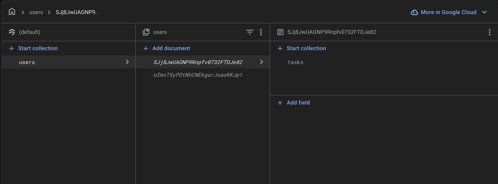
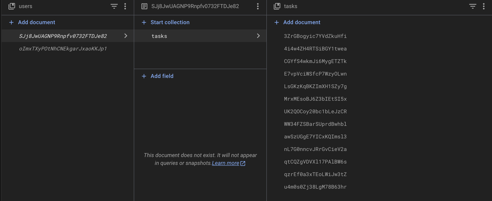
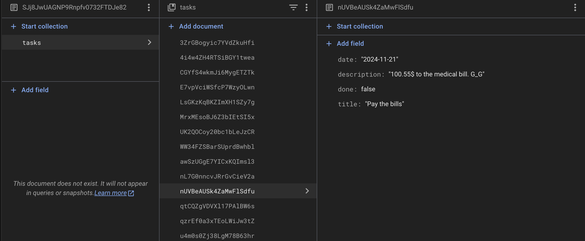

# clever to-do list

## Task

Link to the [task](https://drive.google.com/file/d/18I1PxOxZn2lwm__YeOtMNoWeiXygKwwN/view).

## How to run the app

1. Clone the repo:

   ```bash
   https://github.com/Egorallo/clever-to-do-list.git
   cd clever-to-do-list
   ```

2. Install the necessary dependencies:

   ```bash
   npm install
   ```

3. Compile and Hot-Reload for Development:

   ```bash
   npm run dev
   ```

4. Compile and Minify for Production:

   ```bash
   npm run build
   ```

5. Lint with [ESLint](https://eslint.org/):
   ```bash
   npm run lint
   ```

## Database snapshots







## Application stack

- Vue.js 3
- Vue Router
- Vuex
- Firebase
- ESLint + Prettier
- Vue-content-loader

## Project Structure

```bash
├── src
│   ├── assets/
│   ├── auth/
│   ├── components/
│   ├── firebase/
│   ├── firestore/
│   ├── store/
│   ├── views/
│   └── main.js
│
```

- **`assets/`**: Contains CSS files and icons.
- **`auth/`**: Contains all logic related to user authentication.
- **`components/`**: Containes all the components.
- **`firebase/`**: Firebase initialization.
- **`firestore/`**: Communication with Firestore DB.
- **`store/`**: VueX store for managing tasks, current user and dark mode.
- **`views/`**: Pages for Signing up and Signing in.
- **`App.vue/`**: Main component in Vue application.
- **`main.js/`**: App entry point.

## Deployed on Firebase

https://to-do-list-1ba63.web.app/sign-in
